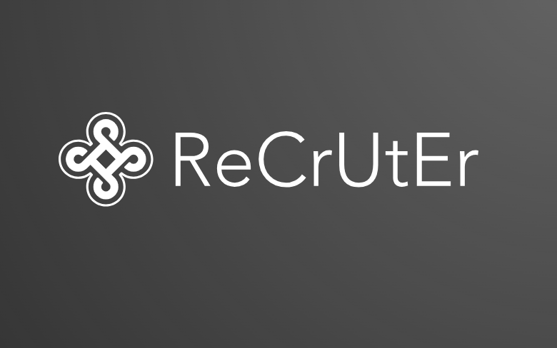

# <p align="center">

# 

# </p>

# AI Trip Planner - Agentic Travel Planning Made Easy

`Python` `3.11+`  `FastAPI` `LATEST`  `Streamlit` `LATEST`  `LangChain` `LATEST`  `LangGraph` `LATEST`

An intelligent AI-powered travel planning assistant that creates comprehensive, personalized trip itineraries with real-time data, cost breakdowns, and detailed recommendations.

- [Quick Start](#quick-start) · ✨ [Features](#features) · 🧭 [Architecture](#architecture) · 🛠 [Configuration](#configuration) · 📚 [API Reference](#api-reference)

# ReCrUtEr - AI-Powered Recruitment Agent 🚀

## Overview

**ReCrUtEr** is an intelligent recruitment agent powered by advanced AI/LLM technologies that automates and streamlines the candidate evaluation process. It analyzes resumes against job descriptions, extracts key skills, identifies strengths and weaknesses, and provides detailed recommendations for candidate improvement.

This tool leverages cutting-edge AI models from multiple providers (OpenAI, Google Generative AI, Groq, Ollama) to deliver comprehensive resume analysis with intelligent candidate-job matching.

---

## Technologies Used 🛠️

### Core Framework

- **Streamlit** - Interactive web application framework for rapid UI development
- **Python 3.8+** - Primary programming language

### AI & Machine Learning

- **LangChain** - LLM orchestration and RAG framework
- **FAISS** - Vector similarity search and clustering
- **OpenAI GPT** - Large language models (GPT-4, GPT-3.5-turbo)
- **Google Generative AI** - Gemini models for text generation
- **Groq** - High-performance LLM inference
- **Ollama** - Local LLM deployment
- **HuggingFace** - Pre-trained embeddings and models

### Document Processing

- **PyPDF2** - PDF text extraction and manipulation
- **RecursiveCharacterTextSplitter** - Intelligent text chunking for RAG

### Data & Visualization

- **Pandas** - Data manipulation and analysis
- **Matplotlib** - Data visualization
- **NumPy** - Numerical computing (via dependencies)

### API & Networking

- **Requests** - HTTP client for API calls
- **LangChain OpenAI** - OpenAI API integration
- **LangChain Google GenAI** - Google API integration
- **LangChain Groq** - Groq API integration
- **LangChain Ollama** - Local Ollama integration

### Development Tools

- **Git** - Version control
- **Jupyter Notebook** - Interactive development environment
- **Python Package Management** - pip

### Architecture Patterns

- **RAG (Retrieval Augmented Generation)** - Enhanced LLM responses with contextual data
- **Multi-Agent System** - Modular AI agent architecture
- **Vector Embeddings** - Semantic search and similarity matching
- **Threading** - Concurrent resume processing

---

## Features ✨

### Core Capabilities

- **Resume Analysis**: Automatically extract and analyze resume content in PDF format
- **Skill Extraction**: Intelligently identify and categorize technical and soft skills
- **JD Matching**: Compare candidate skills against job description requirements
- **Candidate Scoring**: Generate compatibility scores based on skill alignment
- **Strength & Weakness Analysis**: Identify candidate strengths and areas for improvement
- **Personalized Recommendations**: Provide actionable suggestions for candidate development

### Multi-LLM Support

- **OpenAI GPT Models**: ChatGPT integration with embeddings
- **Google Generative AI**: Gemini model support
- **Groq**: High-performance LLM inference
- **Ollama**: Local model support for privacy-focused deployments
- **HuggingFace**: Community models and embeddings

### UI Features

- **Streamlit-based Interface**: Intuitive, user-friendly web application
- **Multi-Role Support**: Pre-configured requirements for 8+ job roles
- **Real-time Analysis**: Instant resume evaluation and feedback
- **Configurable Parameters**: Adjustable cutoff scores and analysis depth
- **Model Selection**: Easy switching between different LLM providers

---

## Supported Job Roles 💼

The agent includes pre-configured skill requirements for:

- AI/ML Engineer
- Frontend Engineer
- Backend Engineer
- Data Engineer
- DevOps Engineer
- Full Stack Developer
- Product Manager
- Data Scientist
- *(Extensible for additional roles)*

---

## Project Structure 📁

```
Recruitment/
├── app.py                 # Main Streamlit application
├── agents.py              # ResumeAnalysisAgent and LLM integration logic
├── ui.py                  # UI components and utilities
├── app.ipynb              # Jupyter notebook for interactive development
├── text/                  # Sample job descriptions and test data
├── image.png              # Project logo/screenshot
└── __pycache__/          # Python cache files
```

## Screenshots 🖼️

A quick visual tour of the application and UI. Click an image to open the full-size screenshot.

<details>
<summary>Open gallery</summary>

| Screenshot | Description |
|---|---|
|  | Main dashboard / landing view |
|  | Resume upload and analysis panel |
|  | Role selection and configuration |
|  | Skill matching results and scoring |
|  | Strengths & weaknesses report |
|  | Recommendations and export options |

</details>

### File Descriptions

#### `app.py` (227 lines)

- Streamlit application entry point
- Defines role-specific skill requirements
- Manages user interface and workflow
- Handles file uploads and processing

#### `agents.py` (866 lines)

- **ResumeAnalysisAgent Class**: Core analysis engine
  - PDF text extraction using PyPDF2
  - RAG (Retrieval Augmented Generation) vectorstore setup
  - Multi-LLM model initialization
  - Skill extraction and matching algorithms
  - Candidate scoring logic
  - Strength/weakness identification
  - Improvement recommendations generation

#### `ui.py` (852 lines)

- Streamlit UI helper functions
- Ollama model listing utility
- Groq API model fetching
- Visualization components
- Data display formatting

---

## Installation & Setup 🔧

### Prerequisites

- Python 3.8+
- pip package manager
- API keys for LLM providers (optional, based on your choice)

### Step 1: Clone Repository

```bash
git clone <repository-url>
cd Recruitment
```

### Step 2: Install Dependencies

```bash
pip install -r requirements.txt
```

### Required Packages

```
streamlit>=1.28.0
langchain>=0.1.0
langchain-openai>=0.0.5
langchain-google-genai>=0.0.4
langchain-groq>=0.0.2
langchain-ollama>=0.0.1
langchain-huggingface>=0.0.1
langchain-community>=0.0.10
langchain-classic>=0.0.1
langchain-text-splitters>=0.0.1
PyPDF2>=3.0.0
faiss-cpu>=1.7.4  # or faiss-gpu for GPU support
pandas>=1.5.0
matplotlib>=3.7.0
requests>=2.31.0
```

### Step 3: Configure API Keys

Create a `.env` file in the project root:

```
OPENAI_API_KEY=your_openai_key
GOOGLE_API_KEY=your_google_api_key
GROQ_API_KEY=your_groq_api_key
```

Or set environment variables directly in your system.

### Step 4: Setup LLM Providers

#### For OpenAI

1. Get API key from [OpenAI Platform](https://platform.openai.com)
2. Set `OPENAI_API_KEY` environment variable

#### For Google Generative AI

1. Get API key from [Google AI Studio](https://makersuite.google.com/app/apikey)
2. Set `GOOGLE_API_KEY` environment variable

#### For Groq

1. Get API key from [Groq Console](https://console.groq.com)
2. Set `GROQ_API_KEY` environment variable

#### For Ollama (Local)

1. Install Ollama from [ollama.ai](https://ollama.ai)
2. Pull desired models: `ollama pull llama2`
3. Run: `ollama serve`

---

## Usage 🎯

### Running the Application

```bash
streamlit run app.py
```

The application will open in your browser at `http://localhost:8501`

### Basic Workflow

1. **Select Job Role**: Choose from pre-configured roles or custom define requirements
2. **Upload Resume**: Upload candidate resume in PDF format
3. **Upload Job Description** (Optional): Provide specific JD for matching
4. **Configure Analysis**:
   - Select LLM provider (OpenAI, Google, Groq, Ollama)
   - Set compatibility cutoff score (0-100)
   - Adjust analysis parameters
5. **Run Analysis**: Click "Analyze Resume" button
6. **Review Results**:
   - Skill extraction summary
   - Compatibility score
   - Strengths and weaknesses
   - Personalized recommendations

### Example Output

```
📊 Resume Analysis Report
─────────────────────────────────

Candidate Name: John Doe
Target Role: AI/ML Engineer
Compatibility Score: 87/100 ✅

🎯 Matched Skills (15/18):
- Python ✓
- PyTorch ✓
- Machine Learning ✓
- ...

⚠️ Missing Skills (3):
- Reinforcement Learning
- MLOps
- AutoML

💪 Strengths:
- Strong Python fundamentals
- Hands-on ML experience
- Published research

🔧 Improvement Areas:
- Limited MLOps experience
- No RL background

📚 Recommendations:
1. Take MLOps courses on platforms like Coursera
2. Complete RL projects on platforms like OpenAI Gym
3. ...
```

---

## API Reference 📚

### ResumeAnalysisAgent Class

#### Initialization

```python
from agents import ResumeAnalysisAgent

agent = ResumeAnalysisAgent(
    llm_name="openai",          # LLM provider
    api_key="your_api_key",     # API key (optional)
    cutoff_score=75,            # Minimum skill match score
    model="gpt-4"               # Specific model name
)
```

#### Key Methods

**`extract_text_from_pdf(pdf_file)`**

- Extracts text from PDF resume
- Returns: Extracted resume text (str)

**`extract_skills(role_requirements)`**

- Extracts skills from resume
- Returns: List of identified skills

**`match_skills_with_requirements(role_requirements)`**

- Compares extracted skills against role requirements
- Returns: Matched skills, missing skills, and match percentage

**`analyze_resume(resume_text, jd_text, role_requirements)`**

- Performs comprehensive resume analysis
- Returns: Analysis results dict with scores, strengths, weaknesses

**`generate_recommendations(analysis_result)`**

- Generates personalized improvement suggestions
- Returns: Dictionary of recommendations by category

---

## Configuration Guide ⚙️

### Role Customization

Add new roles to `ROLE_REQUIREMENTS` dictionary in `app.py`:

```python
ROLE_REQUIREMENTS = {
    "Your New Role": [
        "Skill 1", "Skill 2", "Skill 3",
        # ... add more skills
    ],
}
```

### Model Selection

Different models provide different trade-offs:

| Provider | Model | Speed | Cost | Quality |
|----------|-------|-------|------|---------|
| OpenAI | GPT-4 | Slow | High | Excellent |
| OpenAI | GPT-3.5 | Medium | Low | Good |
| Google | Gemini | Medium | Low | Excellent |
| Groq | LLaMA2 | Fast | Low | Good |
| Ollama | LLaMA2 | Very Fast | Free | Good |

### Cutoff Score Adjustment

```python
agent = ResumeAnalysisAgent(
    llm_name="openai",
    cutoff_score=80  # Stricter matching (0-100)
)
```

---

## Advanced Features 🚀

### RAG (Retrieval Augmented Generation)

The agent uses FAISS vectorstore for semantic similarity matching:

- Chunks resume text intelligently
- Compares against role requirements
- Provides context-aware skill matching

### Multi-Threading Support

- Concurrent resume processing
- Batch analysis capabilities
- ThreadPoolExecutor integration

### Extensibility

- Custom embedding models
- Multiple vectorstore backends
- Pluggable LLM providers

---

## Troubleshooting 🔍

### Issue: "API Key not found"

**Solution**: Ensure environment variables are set correctly

```bash
# Windows PowerShell
$env:OPENAI_API_KEY="your_key"

# Windows CMD
set OPENAI_API_KEY=your_key

# Linux/Mac
export OPENAI_API_KEY=your_key
```

### Issue: "Ollama connection failed"

**Solution**: Ensure Ollama service is running

```bash
ollama serve  # Start Ollama in another terminal
```

### Issue: "PDF extraction error"

**Solution**: Ensure PDF is valid and not corrupted

- Try opening PDF in standard viewer
- Ensure PDF is not password-protected

### Issue: "FAISS import error"

**Solution**: Install FAISS variant

```bash
pip install faiss-cpu  # For CPU-only systems
# or
pip install faiss-gpu  # For GPU-enabled systems (requires CUDA)
```

---

## Performance Optimization 📈

### Tips for Faster Analysis

1. Use Groq or Ollama for real-time processing
2. Reduce cutoff_score for faster matching
3. Use GPU-accelerated FAISS (faiss-gpu)
4. Batch process multiple resumes

### Memory Optimization

```python
# Clear vectorstore periodically
agent.rag_vectorstore = None

# Use CPU-based FAISS
pip install faiss-cpu
```

---

## Contributing 🤝

Contributions are welcome! Areas for improvement:

- [ ] Additional job roles
- [ ] Multi-language support
- [ ] Enhanced UI components
- [ ] Performance optimization
- [ ] Additional LLM providers
- [ ] Export to various formats (PDF, DOCX, Excel)

---

## Security Considerations 🔒

- Store API keys in environment variables or `.env` files
- Never commit `.env` to version control
- Use `.gitignore`:

  ```
  .env
  __pycache__/
  *.pyc
  .streamlit/secrets.toml
  ```

---

## License 📄

[Specify your license here - e.g., MIT, Apache 2.0, etc.]

---

## Support & Contact 💬

For issues, questions, or suggestions:

- Open an GitHub Issue
- Contact: [your-email@example.com]
- Documentation: [link to full docs]

---

## Roadmap 🗺️

- [ ] Database integration for resume storage
- [ ] Interview scheduling automation
- [ ] Skill gap analysis with learning paths
- [ ] Candidate ranking across multiple roles
- [ ] Team collaboration features
- [ ] Analytics dashboard
- [ ] API endpoint for third-party integration

---

## Changelog 📝

### Version 1.0 (Current)

- ✅ Core resume analysis functionality
- ✅ Multi-LLM provider support
- ✅ Skill extraction and matching
- ✅ Strength/weakness analysis
- ✅ Streamlit UI
- ✅ Pre-configured job roles

---

**Made with ❤️ by the ReCrUtEr Team**
